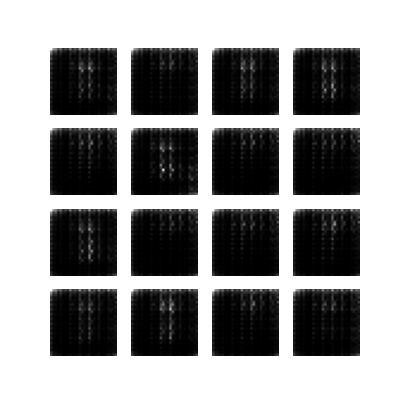
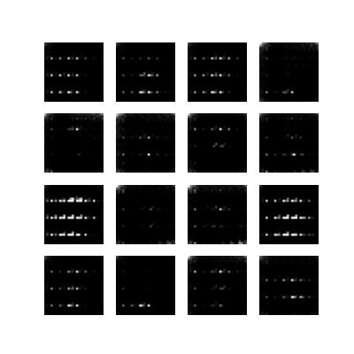
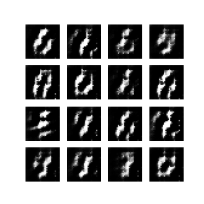
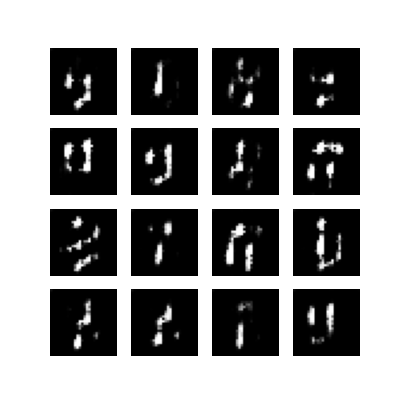

# GAN for MNIST Digit Generation

This project implements a Generative Adversarial Network (GAN) to generate handwritten digits similar to those in the MNIST dataset.

## Project Overview

Generative Adversarial Networks consist of two neural networks (Generator and Discriminator) that compete against each other. The Generator creates fake images, while the Discriminator tries to distinguish between real and fake images. Through this adversarial process, the Generator learns to create increasingly realistic images.

## Architecture

### Generator
- Input: Random noise vector (100-dimensional)
- Architecture:
  - Dense layer to reshape the input (7×7×256)
  - BatchNormalization and LeakyReLU
  - Series of Conv2DTranspose layers to upsample to 28×28×1
  - Tanh activation in the output layer to generate pixel values in [-1, 1]

### Discriminator
- Input: 28×28×1 images (either real from MNIST or fake from Generator)
- Architecture:
  - Convolutional layers with LeakyReLU activations
  - Dropout layers (0.3) for regularization
  - Dense layer with a single output (real or fake classification)

## Hyperparameters
- Learning rate: 1e-4 (Adam optimizer)
- Batch size: 256
- Epochs: 50
- Noise dimension: 100

## Training Process

The GAN was trained using the following procedure:
1. Generate random noise
2. Use the Generator to create fake images
3. Train the Discriminator on both real and fake images
4. Train the Generator to fool the Discriminator
5. Repeat for 50 epochs

## Training Evolution

### Early Training Stages

In the early stages, the generated images show vague patterns but lack clear structure. The model is beginning to learn the general distribution of pixel intensities but hasn't yet captured the digit shapes.

### Mid Training

As training progresses, more defined patterns start to emerge. The Generator is learning the spatial relationships in digit structures, though the outputs still lack clarity and detail.

### Later Training

In the later stages, we can see the Generator producing recognizable digit-like structures. The shapes are more coherent, showing that the model has learned significant features of handwritten digits.

### Final Results

The final generated images show clear, recognizable digits. The Generator has successfully learned to create diverse and realistic handwritten digit samples that closely resemble the MNIST dataset.

## Insights and Observations

### Training Stability
- The GAN training process exhibited typical adversarial dynamics with periods of instability
- Initial epochs showed mostly noise, with coherent patterns emerging gradually
- No significant mode collapse was observed (the model generates diverse digits rather than repeating the same patterns)

### Architectural Considerations
- The choice of LeakyReLU activations helped prevent the vanishing gradient problem
- BatchNormalization layers were crucial for training stability
- The depth of convolutional layers provided sufficient capacity to learn complex patterns

### Performance Analysis
- The Generator successfully learned to create diverse digit representations
- Image quality improved consistently across training epochs
- The final images show good variation in digit styles, comparable to the original MNIST dataset

## Challenges and Lessons Learned

1. **GAN Stability**: GANs are notoriously difficult to train stably. Careful hyperparameter tuning was necessary.
2. **Balancing Generator and Discriminator**: Ensuring neither network overpowered the other was essential for good results.
3. **Evaluation Metrics**: Unlike supervised learning, GANs lack straightforward evaluation metrics, making visual inspection crucial.
4. **Training Duration**: The quality of generated images continues to improve with more training epochs.

## Conclusion

This project demonstrates the successful implementation of a GAN for generating MNIST-like handwritten digits. The model progresses from generating random noise to producing recognizable digits through adversarial training. The final results show that the Generator has captured the essential characteristics of handwritten digits and can generate diverse, realistic samples.

## Future Work

- Implement conditional GAN to generate specific digits
- Explore more complex architectures like DCGAN or WGAN
- Apply techniques to improve training stability
- Experiment with different loss functions and regularization techniques